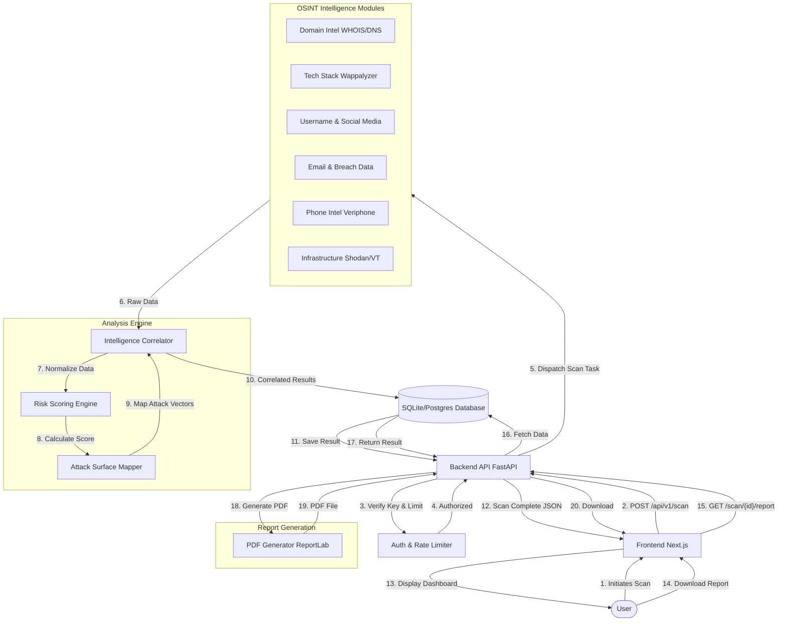

# 🔄 OSINT Platform Architecture Flowchart

## 📝 Detailed Data Flow

1.  **Initiation**: The user enters a target (e.g., `example.com`, `+1234567890`) in the Next.js Frontend.
2.  **API Request**: The Frontend sends a secure POST request to the FastAPI Backend, including the API Key.
3.  **Security Check**: The Backend verifies the API Key and checks Rate Limits (e.g., 5 req/min) via `slowapi`.
4.  **Module Dispatch**: Based on the `scan_type` (domain, phone, username), the backend triggers specific **OSINT Modules** in parallel using `asyncio`.
    *   *Domain Intel*: Fetches WHOIS, DNS records, and subdomains (crt.sh).
    *   *Phone Intel*: Validates number and carrier info via Veriphone.
    *   *Infrastructure*: Checks IP reputation (VirusTotal) and open ports (Shodan).
5.  **Correlation**: Collected raw data is sent to the **Analysis Engine**.
    *   *Risk Scoring*: AI logic calculates a risk score (0-100) based on open ports, vulnerabilities, and exposed emails.
    *   *Attack Surface*: Identifies critical weak points (e.g., "Exposed Admin Panel", "Leaked Credentials").
6.  **Storage**: The final structured JSON result is saved to the SQLite/PostgreSQL database.
7.  **Visualization**: The Frontend receives the JSON and renders the **Interactive Dashboard** with graphs and alerts.
8.  **Reporting**: When the user clicks "Download Report", the **Report Generator** fetches the stored data, uses `ReportLab` to draw a professional PDF, and streams it back to the user.
